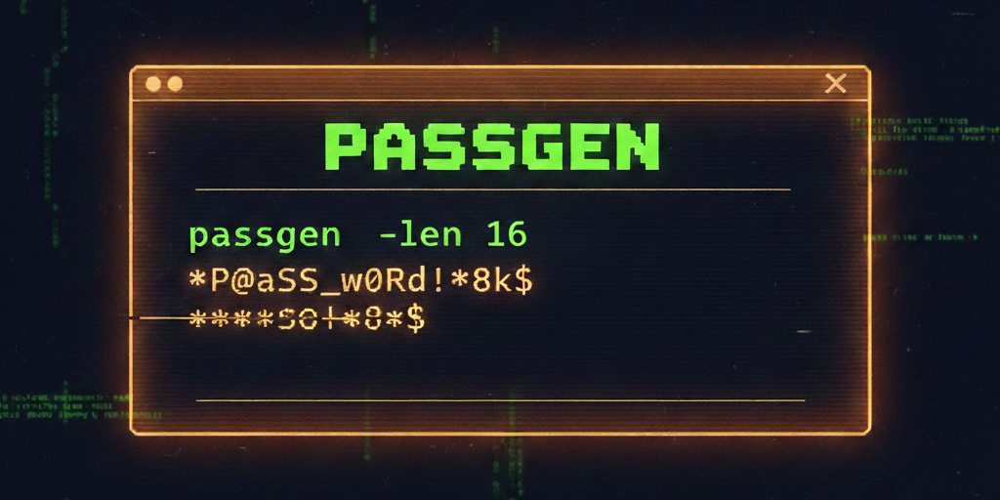

# Passgen — Secure Passwords from the Terminal

Passgen is a small Go CLI that generates strong random passwords from the terminal. By default it enables all character sets and uses `crypto/rand` for cryptographically secure randomness.


## Quickstart
```bash
# basic (all character sets by default)
passgen -len 16 -count 3

# lower/upper/digits only
passgen -len 24 -count 5 -lower -upper -digits

# symbols only, excluding "@$"
passgen -len 20 -symbols -exclude "@$"

# exclude ambiguous characters (0 O 1 l I)
passgen -len 16 -no-ambiguous

# copy generated passwords to clipboard
passgen -len 20 -count 3 -copy

# render first password as QR code in terminal (requires -count 1)
passgen -len 20 -qr
```

## Highlights
- Flexible character sets: `-lower`, `-upper`, `-digits`, `-symbols`
- Length and count control: `-len`, `-count`
- Exclusions: `-exclude`, `-no-ambiguous`
- Clipboard and QR output: `-copy`, `-qr`

## Next Steps
- Installation
- Usage
